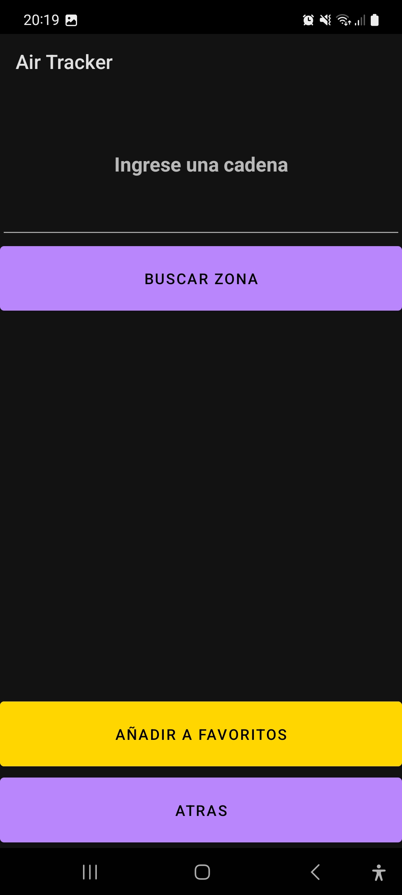
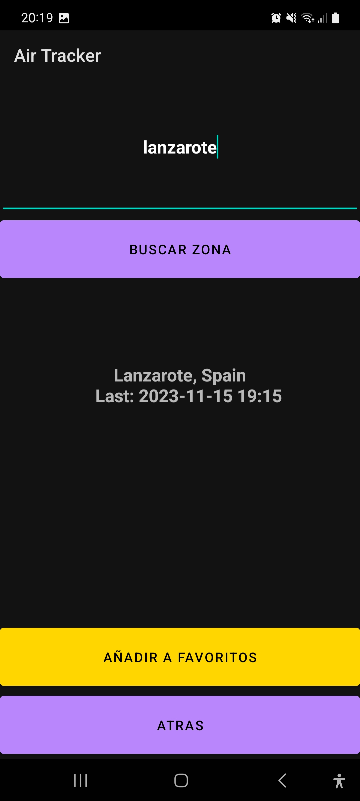
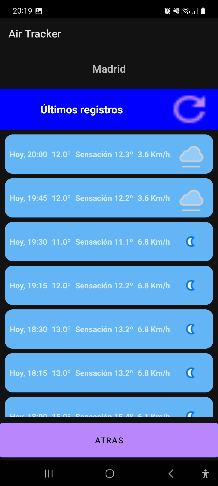

# AirTracker
## Autor - Álvaro RG

## Introducción
Se ha desarrollado una aplicación de android para obtener reportes de varias magnitudes temporales
de una zona en concreto. 

El usuario puede guardar una lista de zonas favoritas las cuales aparecerán en la pantalla principal
con los datos obtenidos en su último reporte.

## Tecnologías
### Obtención de datos
Estos datos temporales han sido obtenidos mediante el uso de la API ofrecida por:
 * [Air Quality Programmatic APIs](https://aqicn.org/api/es/)
Para realizar peticiones a esta interfaz se ha hecho uso de la librería `Retrofit`.

También se ha hecho uso de la librería `Picasso` para obtener las imagenes asociadas a dichos registros.

### Almacenamiento de información en la nube
Además, para almacenar todos los datos obtenidos de estas peticiones y las preferencias de cada usuario
se han empleado las prestaciones de `Google Firebase` para implementar los servicios de:

* *Autenticación*: haciendo uso de `Firebase Authentication`.
* *Persistencia de datos*: gracias a la herramienta `Firebase Realtime Database`.

## Resumen de prestaciones
En este apartado se muestra una breve visualización de las diferentes pantallas.
### Pantalla principal
En ella se muestran las zonas favoritas del usuario con sus últimos datos mas importantes
como la hora a la que recibieron la temperatura y el icono del clima.

  

En esta pantalla aparecen tres botones:
* *Refresh*: lanza una peticion a la base de datos en busca de nuevos registros de las
  zonas favoritas.
  
* Botón *+*: Navega a la pantalla para añadir una nueva zona preferida.
* 
* *Icono del clima*: al pinchar sobre él, se navega a una pantalla donde se podrán ver todos
  los registros obtenidos de la zona.
  
  
